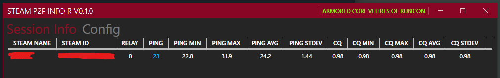

# SteamP2PInfo-Rubiconian

tremwil氏作のSteamP2PInfoに余分な機能を追加するプロジェクトです。  
Original: [tremwil/SteamP2PInfo](https://github.com/tremwil/SteamP2PInfo)  

Armored Core VI での使用を念頭に開発  

## 追加した機能

全ては余分に過ぎないのだ…

### Session Info
- リレーサーバー使用有無表示
- 接続メソッド表示(SteamNetworking/SteamNetworkingSocket)
- 相手側Connection Quality表示
  - SteamNetworkingSocketでの接続時のみ。AC6では取得できない様子
- 接続情報統計表示
  - Ping, Connection Quality, Connection Quality Remoteについて下記を表示
    - Min: 最小値
    - Max: 最大値
    - Avg: 平均
    - Stdev: 標準偏差

### History
オリジナルのSteamP2PInfoにはなかった履歴機能を追加

- プログラムを閉じるまで統計情報の履歴を保持
- Configから履歴出力を有効化するとプログラム終了時に指定フォルダに.csvファイルを出力
  - 出力先フォルダは監視対象プロセス指定後に設定可能

### オーバーレイ
- リレーサーバーの使用有無表示

### その他
- 更新自動チェック機能の無効化設定

## 使い方

オリジナルのSteamP2PInfoに準じます。

1. releasesからダウンロードしたZIPを展開し、`SteamP2PInfo.exe`を起動  
1. ゲームを起動したら、SteamP2PInfoのウィンドウのタイトルバー右側にある"Attach Game"をクリック
1. 対象のプロセスを選択  
   - ※初回のみAppIdの設定が必要。SteamDB等で確認のこと。（例、AC6は`1888160`）
1. SteamP2PInfoに「Necessary Step」で始まるメッセージが表示される
1. 「Copy Command」ボタンを押下するとクリップボードに必要なコマンドがコピーされ、メッセージが消える
1. Steamクライアントアプリを開き、「コンソール」画面下部のテキストボックスにコピーしたコマンドを貼り付けてEnter
   - Steamクライアントアプリを終了するまではコンソールでのコマンド実行は初回のみでよい（ゲームやSteamP2PInfoを再起動した場合でも再度貼り付け&Enterは不要）
   - 「コンソール」タブが表示されない場合はこちらをクリック：[steam://open/console](steam://open/console)
1. 必要に応じてSteamP2PInfoのConfigタブで設定を行う
1. P2P接続が行われるとSession Infoタブに情報が表示される
1. 履歴出力機能が有効であれば、SteamP2PInfo終了時に履歴がファイルに書き出される

## バージョンアップ方法
設定は`SteamP2PInfo.exe`と同じ階層にある`config`フォルダに保存されています。  
これを引き継ぐことができれば設定が維持されます。

### 方法1: 既存のSteamP2PInfoを置き換える場合
1. releasesからダウンロードしたZIPを展開
1. 既存のSteamP2PInfoのあるフォルダ内に1.で展開したフォルダの中身を貼り付けてすべて上書き

### 方法2: 設定ファイルを取り出して引き継ぐ場合
1. releasesからダウンロードしたZIPを展開
1. 既存のSteamP2PInfoのあるフォルダ内から`config`フォルダをコピー
1. 1.で展開したフォルダ内にコピーした`config`フォルダを貼り付ける
1. 新しいSteamP2PInfoを起動